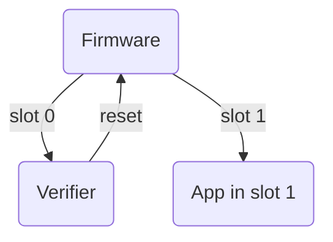
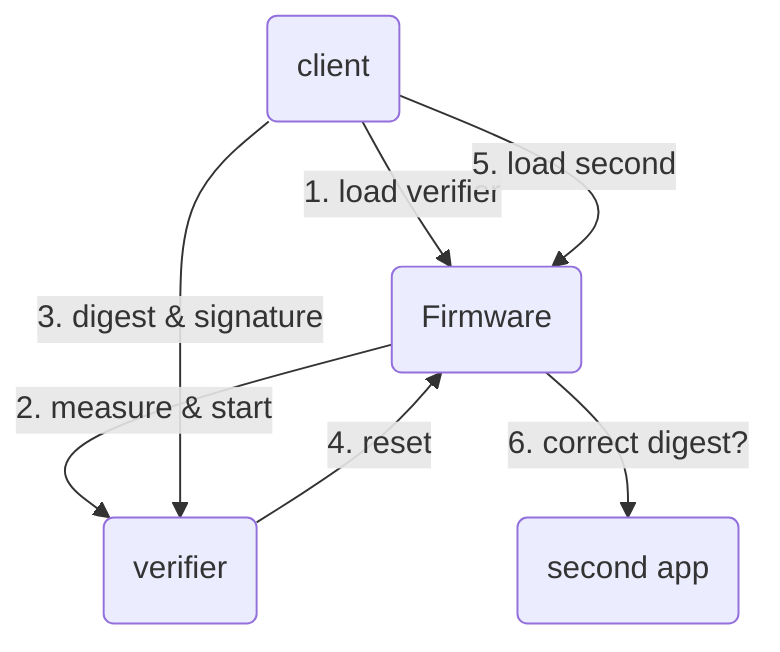

# tkey-boot-verifier

**WARNING**: Work in progress!

tkey-boot-verifier is a second boot stage for the Tillitis TKey. It
verifies the next app to start and leaves a seed to the second app
that can be used as base for key material. This way, we combine the
TKey's ordinary measured boot with verified boot and makes it possible
to upgrade the second app without losing key material.

tkey-boot-verifier can start either from slot 0 in flash or be fed to
the TKey by a client app.

## Start from flash



This is the goal of the verifier and how it should work when
development is finished. Currently it behaves like this after you have
used `verifier-client -cmd install`. For test purposes, however, it
currently waits for commands from the client after power cycling.

Firmware checks `resetinfo` for what to do: Default is to start the
app in slot 0.

tkey-boot-verifier resides in slot 0. It reads the app digest of slot
1 and the vendor signature of it from the filesystem and verifies the
signature. If the signature verifies, it resets to firmware,
signalling to firmware through `resetinfo` that it should load an app
from slot 1 only if it has the exact digest it just verified.

Firmware starts again, now loading the app from slot 1. If the
computed digest of the app is correct it starts it.

## Start from client



The above diagram assumes that the firmware is running in a state
where it is waiting for commands from a client. This will not really
be the case in the coming Castor version of the TKey, but simplified
here to better explain the verifier's role.

1. The client loads the verifier.
2. Firmware measures and starts verifier.
3. Client sends the digest and signature of the next app.
4. verifier verifies the signature over the digest. If it verifies, it
   sends the digest to the firmware and resets the TKey, making
   firmware start again.
5. Client loads the next app.
6. Firmware measures the next app. If it has the correct, already
   verified digest, it starts it.

The coming Castor will be slightly more complicated since it will also
require the client to tell the running device app to reset at first.

## Build

To build both client app, `verifier-client`, and the device app,
`verifier`, run:

```
./build.sh
```

## Use

For all uses of the verifier, you need to build [a current Castor
TKey](https://github.com/tillitis/tillitis-key1) which by default uses
the `defaultapp` in slot 0. Flash it on a TKey Unlocked with the TKey
Programmer Board. Buy here:

https://shop.tillitis.se/

You will also need [a CH55x reset
controller](https://shop.blinkinlabs.com/products/ch55x-reset-controller)
to update the USB controller firmware to Castor.

See [TKey Developer
Handbook](https://dev.tillitis.se/castor/unlocked/) for instructions.

The verifier can be placed on flash, typically slot 0, then verifying
slot 1, or loaded by a client app, followed by the app to be verified.

### Produce flash image

To install the verifier on the flash, use the `tkeyimage` tool in
[tillitis-key1](https://github.com/tillitis/tillitis-key1). Typically:

```
$ cp verifier/app.bin ../tillitis-key1/hw/application_fpga/
$ cd ../tillitis-key1/hw/application_fpga/
$ ./tools/tkeyimage/tkeyimage -f -app0 verifier.bin -o flash_image.bin
$ make FLASH_APP_0=verifier.bin prog_flash
```

You will now have a verifier in app slot 0. In the current state of
development it will wait for commands from the client after starting.
This is not the end goal, but sufficient for development.

You can try talking to it with `verifier-client -cmd install`, see
below.

### verifier-client

- `verifier-client -cmd boot -app path`
- `verifier-client -cmd install -app path`

Command `boot` does a verified boot of the device app specified with
`-app`. It assumes a TKey running firmware which is waiting for
commands from client. In the current state of development this
typically means a Castor prototype with the `defaultapp` in app slot
0.

Command `install` installs the device app specified with `-app` in
slot 1. It assumes you are running a verifier from slot 0 which is
waiting for commands from the client. See above about producing a
flash image for this use case. It will automatically reset the TKey
after installing, telling firmware to start the verifier on flash,
which will then verify slot 1's digest and reset again to ask firmware
to start slot 1.

## TODO

- Change default behaviour of verifier to always start app slot 1,
  instead of waiting for commands.
  
- Investigate what to mix in for the seed for the next app. At least
  mix in a name of the app, so not all device apps verified by the
  verifier get the same seed. Mix in the pubkey (too?), so the seed is
  always dependent on the vendor.

- When installing an app in slot 1, always reset digest and signature
  first, and detect it on start, so we can resume a botched
  installation.

- Change state machine to:

  ```mermaid
  stateDiagram-v2
    [*] --> INIT
    INIT --> VERIFY_FLASH: next_app_data == 17
    INIT --> WAIT_FOR_COMMAND: next_app_data != 17
    VERIFY_FLASH --> BOOT
    WAIT_FOR_COMMAND --> WAIT_FOR_APP_CHUNK: CMD_UPDATE_APP_INIT
    WAIT_FOR_APP_CHUNK --> WAIT_FOR_APP_CHUNK: CMD_UPDATE_APP_CHUNK
    WAIT_FOR_APP_CHUNK --> BOOT: Last CMD_UPDATE_APP_CHUNK
    BOOT --> [*]
  ```
