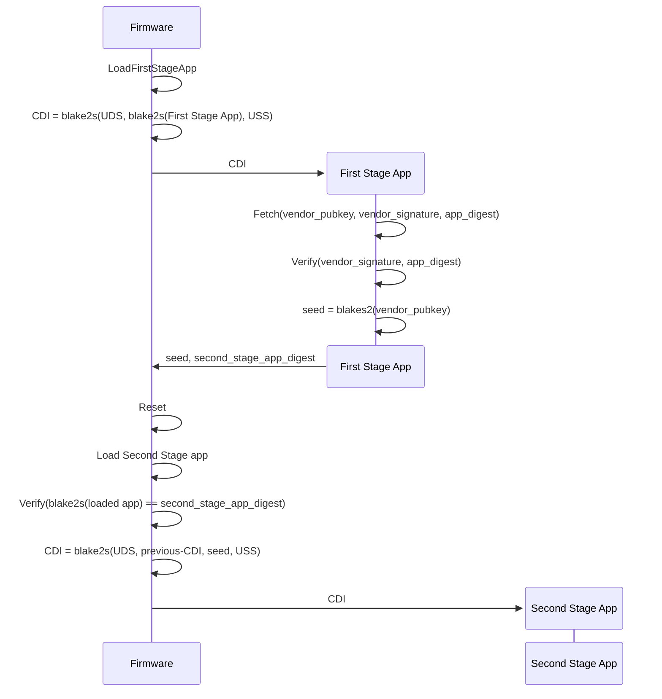
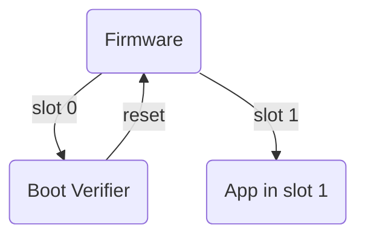
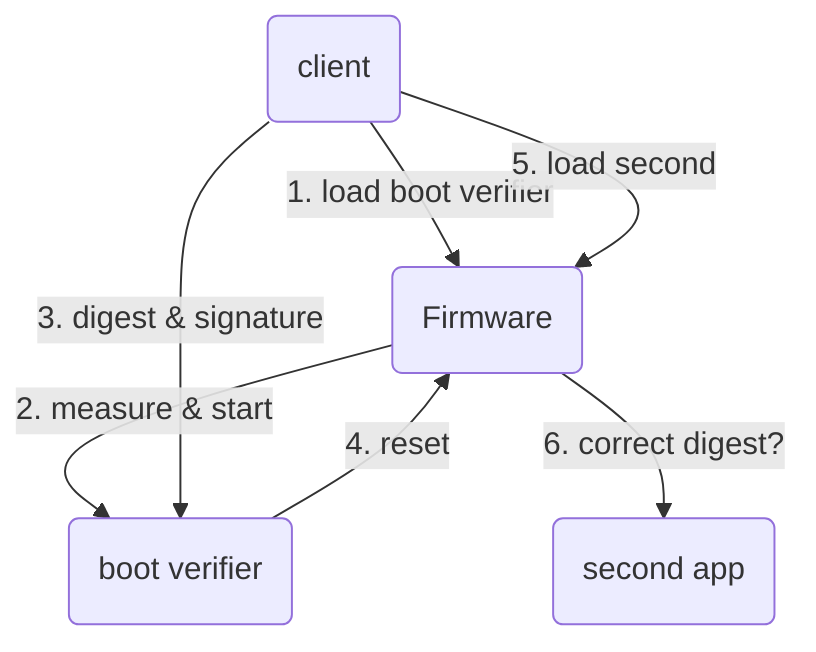

# Verified boot design

## Introduction

The TKey boot verifier is a boot stage for the Tillitis TKey. With the
support of the TKey firmware it implements a combination of measured
boot and verified boot which makes it possible to upgrade the verified
app without losing data, including the cryptographic keys.

## Requirements

- The boot verifier should verify an Ed25519 signature over an app
  digest.

- The boot verifier should be able to pass this verified app digest to
  firmware when doing the reset system call.

- Firmware should ensure that the measured app's digest is exactly
  what boot verifier passed to it and otherwise halt execution.

- The boot verifier should be trusted explicitly by firmware when
  started from flash. Its app digest should be directly inserted into
  ROM and the firmware should halt execution if it hasn't got the
  right app digest when loaded to RAM.

- Key material of the app verified by boot verifier must be deterministic.
  If it is updated, key material should be able to stay the same.

- Different apps should not share CDI with each other, only different
  versions of the same app.

- The boot verifier must not know the key material of the verified
  app, and vice versa.

- Access to the same app storage should be available even after an app
  has been updated.

- An app should always be able to use the Compund Device Identifier
  (CDI) to derive key material.

## Firmware, measurements, and storage access

Quick reminder of how the TKey (Castor version) works:

- Chaining of apps: Castor supports reset from software. Below we talk
  about the current running device app as app[n], the previous app as
  app[n-1] and the app that is going to start as app[n+1].

  Apps calling `sys_reset()` pass a reset type, and for some of them
  an expected app[n+1] digest. If using these reset types, firmware
  will halt execution if the expected and measured app digest of
  app[n+1] don't match. An app calling `sys_reset()` can also pass a
  seed to be included in the CDI (see below).

- Trusted boot verifier: When starting after power up, the default reset
  type is starting from flash slot 0 (boot verifier) with an expected
  application digest hard coded into ROM.

- UDS: Unique Device Secret. This is a per-device hardware secret
  accessible to the firmware once per reset cycle. The UDS is
  inaccessible to the device app. This is used as an input in the
  measured boot.

- USS: User Supplied Secret. An optional input to the measured boot,
  typically a digest of a passphrase inserted by the user.

- CDI: Compound Device Identifier. CDI represents a combination of a
  particular hardware and software chain.

  By default it is computed using the UDS, the measurement
  of the first immutable software after reset, and an optional User
  Supplied Secret (USS). CDI can optionally be based on other
  measurements.

  The CDI is a secret. It can be used to derive new key material.

  The CDI is always computed by the trusted and immutable firmware
  after a reset (power cycle or softare reset) before passing control
  to an app. The CDI is computed like this:

  ```
  CDI = BLAKE2S(UDS, digest)
  ```

  or like this, if given a USS:

  ```
  CDI = BLAKE2S(UDS, digest, USS)
  ```

  [BLAKE2s](https://www.rfc-editor.org/rfc/rfc7693) is a cryptographic
  hash function.

  The digest passed to the BLAKE2s function is always computed by the
  firmware. It can be computed in two different ways:

  1. The default case, measuring the loaded, but not yet started, device
     app:

     ```
     digest = BLAKE2S(entire loaded app in RAM)
     ```

  2. When chaining apps and app[n-1] left a 32 byte seed:

     ```
     digest = BLAKE2S(app[n-1]'s CDI, seed)
     ```

     In the specific case of the boot verifier we're talking about here,
     app[n-1] is the CDI of the boot verifier itself.

     The seed can be whatever the caller wants to include in the
     measurement, typically a digest of its trust policy.

     Note that the caller's CDI, which is outside of the caller's
     control since CDI is not writable in app mode on the TKey, is
     always included in the computation by the firmware. This creates
     a chain from parent to child, back to the integrity of the
     original app after power up.

     Also note that resulting new CDI is unknowable by the calling
     app, since it doesn't know the UDS. Key material isn't leaked
     either up or down the chain.

- Access to any allocated app storage is protected by firmware by an
  access key, computed like this:

  ```
  key = BLAKE2S(CDI, nonce)
  ```

  The nonce is generated when allocating a storage slot and stored in
  the filesystem metadata. A device app can't access any storage slots
  for other CDIs.

## boot verifier



The boot verifier app fetches (from the filesystem or from the client):

- a vendor public key
- an app digest for app[n+1]
- signature(app[n+1] digest)

If the signature verifies agains the public key, it does a
`sys_reset()` system call with `seed` computed like this:

```
seed = blake2s(vendor_pubkey)
```

Then the firmware takes over as described earlier.

In order to satisfy the requirement for different CDI for different
apps you have to use different vendor key pairs for different apps.
This might be as easy as using different USS for your TKey, perhaps a
combination of common a secret USS and a simple name of the app.

XXX Another way of fulfilling this requirement is to introduce an app
name the boot verifier fetches from the filesystem metadata or from
the client. Discuss!

## Start from flash



Firmware checks what to do: Default is to start the app in slot 0
where boot verifier resides.

The boot verifier reads the data it needs (see above) from the
filesystem, verifies the signature, computes the seed, and resets,
passing along the reset type app "start from slot 1", digest of
app[n+1], and the seed.

## Start from client



1. The client loads the boot verifier.
2. Firmware measures and starts boot verifier.
3. Client sends the digest, signature, and vendor public key of
   app[n+1]
4. boot verifier verifies the signature. If it verifies, it sends the
   digest and `seed` to the firmware and resets the TKey with the
   reset type "start verified from client".
5. Client loads the app[n+1].
6. Firmware measures the app. If it has the correct digest it computes
   a new CDI and passes control to the app.

This is slightly simplified. Castor requires the client to tell the
already running device app, typically FIDO2, to reset to firmware
"load from client" to even start this process.
