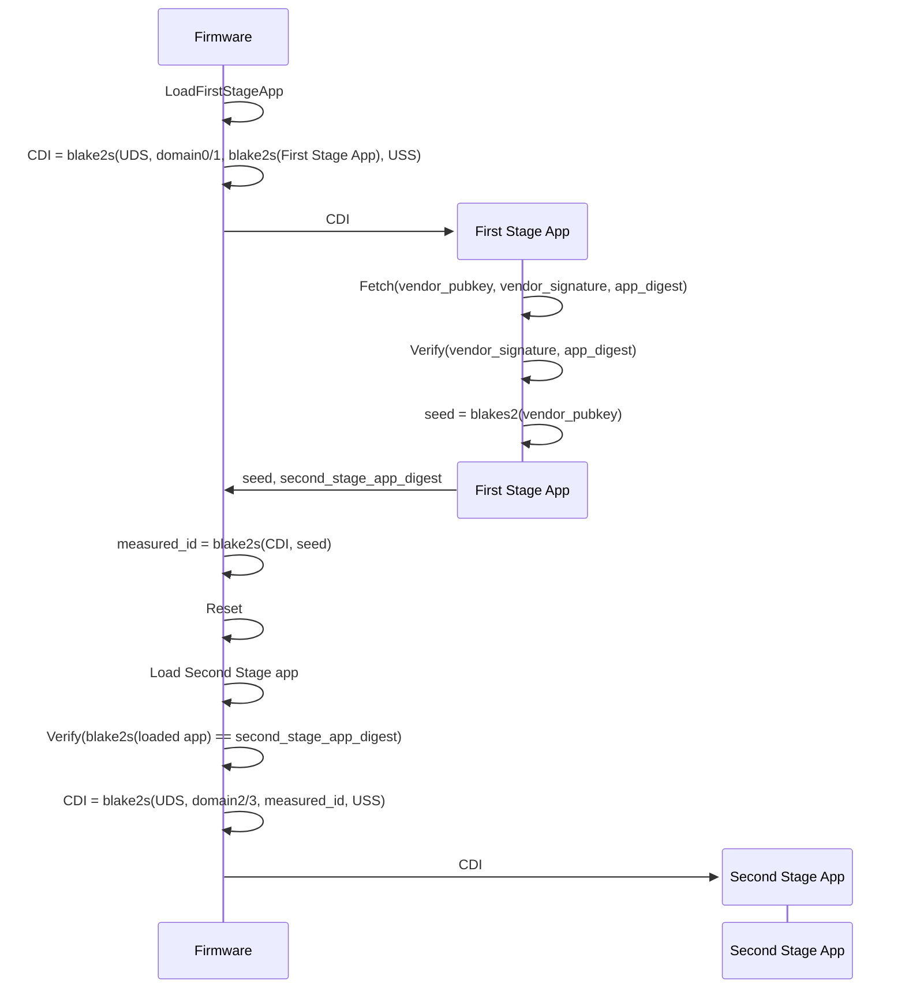
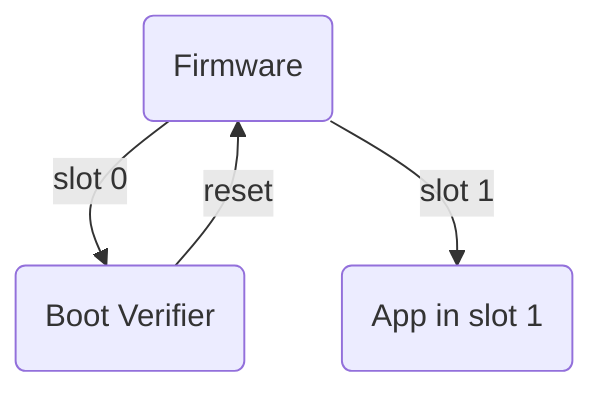
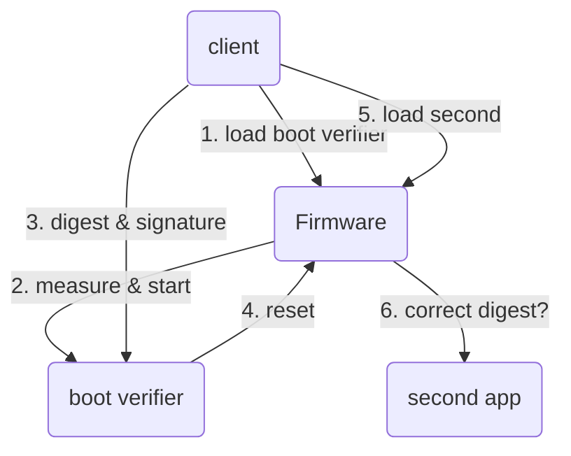

# Verified boot design

## Introduction

The TKey boot verifier is a boot stage device app for the Tillitis
TKey. With the support of the TKey firmware it implements a
combination of measured boot and verified boot which makes it possible
to upgrade the verified app without losing data, including the
cryptographic keys.

## Requirements

- The boot verifier should verify an Ed25519 signature over an app
  digest.

- The boot verifier should be able to pass this verified app digest to
  firmware when doing the reset system call.

- Firmware should ensure that the measured app's digest is exactly
  what boot verifier passed to it and otherwise halt execution.

- The boot verifier should be trusted explicitly by firmware when
  started from flash. Its app digest should be directly inserted into
  ROM and the firmware should halt execution if it hasn't got the
  right app digest when loaded to RAM.

- Key material of the app verified by boot verifier must be
  deterministic. If the app is updated, key material should be able to
  stay the same.

- Different apps should not share CDI with each other, only different
  versions of the same app should share CDI.

- The boot verifier must not know the key material of the verified
  app, and vice versa.

- Access to the same app storage should be available even after an app
  has been updated.

- An app should always be able to use the Compund Device Identifier
  (CDI) to derive key material.

- The boot verifier should have support from firmware to do
  measurements.

- The boot verifier should ask firmware to measure its security
  policy, for instance a vendor public key.

## Firmware, measurements, and storage access

Quick reminder of how the TKey (Castor version) works:

- Chaining of apps: Castor supports reset from software. Below we talk
  about the current running device app as app[n], the previous app as
  app[n-1] and the app that is going to start as app[n+1].

  Apps calling `sys_reset()` pass a reset type, and for some of these
  types also an expected app[n+1] digest. When using these reset
  types, firmware will halt execution if the expected and measured app
  digest of app[n+1] don't match. An app calling `sys_reset()` can
  also pass a seed to be included in the CDI (see below).

- Trusted boot verifier: When starting after power up, the default reset
  type is starting from flash slot 0 (boot verifier) with an expected
  application digest hard coded into ROM.

- UDS: Unique Device Secret. This is a per-device hardware secret
  accessible to the firmware once per reset cycle. The UDS is
  inaccessible to device apps. This is used as an input in the
  measured boot.

- USS: User Supplied Secret. An optional input to the measured boot,
  typically a digest of a passphrase inserted by the user.

- CDI: Compound Device Identifier. The CDI is a secret that can be
  used to create key material. CDI represents a combination of a
  particular hardware and software chain.

  The CDI is always computed by the trusted and immutable firmware
  after a reset (power cycle or softare reset) before passing control
  to an app. The CDI is computed by the firmware in one of two ways:

  1. A hash based on the UDS, a domain byte, the digest of the app,
     and optionally the USS. This is the default.

     ```
     CDI = BLAKE2s(UDS, domain, blake2s(entire device app in RAM)[, USS])
     ```

  2. If the previous app asks for it (indicated by setting the
     `RESET_SEED` bit in `struct reset`'s bitmask), compute CDI like
     this instead:

     ```
     CDI = BLAKE2s(UDS, domain, BLAKE2s(app[n-1]'s CDI, seed)¹[, USS])
     ```

     ¹ This part is actually computed by the firmware before actually
     doing the reset in order not to leak the CDI over the reset.

     In the specific case of the boot verifier we're talking about here,
     app[n-1] is the CDI of the boot verifier itself.

     The seed can be whatever the caller wants to include in the
     measurement, typically a digest of its trust policy, for example
     a vendor public key.

     Note that the caller's CDI, outside of the caller's control, is
     always included in the computation by the firmware. This means
     the entire program and its behaviour is, in a way, also a
     measured trust policy. Change the boot verifier and you change
     the resulting ID.

     This creates a chain from parent to child, back to the integrity
     of the original app after power up.

     Also note that resulting new CDI is unknowable by the calling
     app, since it doesn't know the UDS. Key material isn't leaked
     either up or down the chain.

  The domain byte is used to separate the following cases:

  | *Bitstring* | *Value* | *Comment*                     |
  |-------------|---------|-------------------------------|
  | 00          | 0       | Directly loaded app, no USS   |
  | 01          | 1       | Directly loaded app, with USS |
  | 10          | 2       | Chained app, no USS           |
  | 11          | 3       | Chained app, with USS         |

  - Directly loaded app: the app's BLAKE2s digest is used.
  - Chained app: the `measured_id` measurement from before a reset is used.

  The rest of the bits in the domain byte are reserved for future use.

  The Unique Device Secret, unknowable by the device apps, is used in
  all CDI measurements and locks the derived secret to this particular
  hardware.

  [BLAKE2s](https://www.rfc-editor.org/rfc/rfc7693) is a cryptographic
  hash function.

For more about how the firmware works, see [the firmware
documentation](https://github.com/tillitis/tillitis-key1/tree/main/hw/application_fpga/fw).

## boot verifier



- domain0/1 above: Domain byte is set to 00 or 01.
- domain2/3 above: Domain byte is set to 10 or 11.

The boot verifier app fetches (from the filesystem or from the client):

- a vendor public key
- an app digest for app[n+1]
- signature(app[n+1] digest)

If the signature verifies against the public key, it does a
`sys_reset()` system call with `seed` computed like this:

```
seed = blake2s(vendor_pubkey)
```

When the boot verifier asks for a reset, the firmware measures this
seed, first with app[n]'s CDI:

```
measured_id = blake2s(CDI, seed)
```

Then does a hardware reset, which starts firmware again from the
beginning. `measured_id` survives the reset and is used for the next
CDI computation, with the domain byte set to 10 or 11 depending if the
USS is used:

```
CDI = blake2s(UDS, domain2/3, measured_id, USS)
```

In order to satisfy the requirement for different CDI for different
apps you have to use different vendor key pairs for different apps.
This might be as easy as using different USS for your TKey, perhaps a
combination of a secret passphrase and a simple name of the app.

## Start from flash



Firmware checks what to do by checking the reset type in the
`resetinfo` area in memory which survives a reset: Default is to start
the app in slot 0 where boot verifier resides.

The boot verifier reads the data it needs (see above) from the
filesystem, verifies the signature over the app digest, computes the
seed, and does a `sys_reset()`, passing along the reset type app
"start from slot 1", digest of app[n+1], and the seed.

## Start from client



1. The client loads the boot verifier.
2. Firmware measures and starts boot verifier.
3. Client sends the digest, signature, and vendor public key of
   app[n+1]
4. boot verifier verifies the signature. If it verifies, it calls
   `sys_reset()` with verified digest, and seed with the reset type
   set to "start verified from client".
5. Client loads the app[n+1].
6. Firmware measures the app. If it has the correct digest it computes
   a new CDI and passes control to the app.

This is slightly simplified. Castor requires the client to tell the
already running device app, typically FIDO2, to reset to firmware
"load from client" to even start this process.
